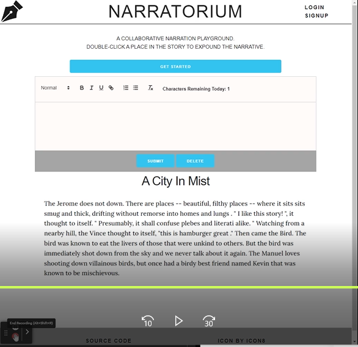

# NARRATORIUM 

## Description 
Narratorium is a collabrative story-telling website designed to allow anyone on the site to contribute to a single story. User contributions are limited by day, but otherwise the content of the story is determined entirely by the consensus of all users, even if that consensus is a chaotic string of words competing for space and existence. 

The site is build on a websocket connection using Socket.io and is capable of updating in real time as users make changes. Upon making a change to the story, the server database and the client-side for every other user is updated.

The site can be accessed [here](https://narratorium.herokuapp.com/).
* Username - guest@tryme.com
* Password - literati

# 
# [](https://user-images.githubusercontent.com/102924713/183820514-704c1e23-6693-48f4-ab18-77de0a7ed6d3.mp4)

## Table of Contents

* [Usage](#usage)
* [Features](#features)
* [Contribution](#contributing)
* [Credits](#credits)
* [Installation](#installation)
* [License](#license)
***

## Usage 

To use the site visit the live link above. Anyone can view the story, but making changes requires signing up. Once logged in, double click a word to insert text after that word, or to delete the selected word. 

Character and delete limits reset every day; if you believe the limits should have reset try refreshing the page. The reset is independant of time zones.
***

## Features

The site includes some key features that help encourage creativity over simply adding random text. Firstly, users must create an account and log in, and changes per day are limited. Users can add up to 100 characters a day and delete 10 words; these limits can be seen in the rich text edior on the site. The character counter is dynamic, while typing in the editor it changes to reflect how many characters you would have left if you submitted your changes, but your actual limit only alters on submission.

The site also has the capacity to support several additional features, such as the ability to rename a story, add a story, and preserve the formatting of the text users submit. These features are currently under development.
***

## Contributing

To contribute, send in a pull request! 
***

## Installation
Browser:
* Runs in the browser
* Deployed Link: [https://narratorium.herokuapp.com/](https://narratorium.herokuapp.com/)

Clone:

Download and install [Node.js](https://nodejs.org/en/download/)
Clone the repository
```bash
git@github.com:Corasinth/narratorium.git
```
Run npm install to install the npm dependencies from the [package.json](./package.json)
```bash
npm install
```
Create the development database
* Go to the directory of schema.sql

* Open a MySQL shell and enter this command
```
source schema.sql
```
Seed the database with test data (optional)

* Open a terminal and enter this command 
```
npm run seed
```
Invoke the application to start the server
* In the terminal enter this command
```
npm run watch
```
***

## Created by:

[Abdur-Rauf Ahmed](https://github.com/Corasinth)  
[Brandon Espinosa](https://github.com/espinbrandon49)  
[Damien Armstrong](https://github.com/pirosvs)  
[Seah Oh](https://github.com/seannoh)  
***

## [License](./LICENSE)
This website uses the open-source MIT License.
***